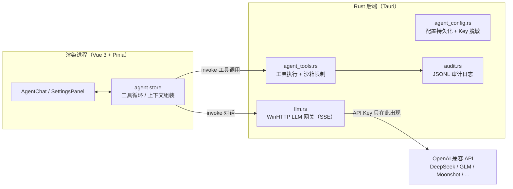

# New AI — 桌面 AI Agent 宠物

[](https://github.com/YOUR_GITHUB_USERNAME/new-ai/actions/workflows/ci.yml)
[](LICENSE)

基于 **Tauri 2（Rust + Vue 3）** 的桌面宠物形态 AI Agent：双击桌宠唤起对话窗口，接入 DeepSeek 等 OpenAI 兼容接口，支持 SSE 流式对话、工具调用、计划式自主执行与审计日志。基础桌面壳复用自开源项目 [AIbubu（AI 步步）](https://github.com/funAgent/ai-bubu)，Agent 能力为独立实现。

## 功能特性

- **流式对话**：SSE 流式输出、多轮会话持久化（localStorage 自动恢复）、中英双语、明暗主题
- **工具调用**：16 个实工具 + 3 个元工具——桌宠显隐、打开链接、系统信息、时间、便签、系统通知、剪贴板读写、受限文件读写/删除、命令执行（默认关闭）、Tavily 联网搜索
- **计划式自主执行**：`create_plan → 逐步 update_step → finish`，计划需用户确认后才转入执行
- **多供应商**：内置 DeepSeek / OpenAI / Moonshot / Qwen / GLM / Ollama 预设，支持 reasoner 模型的 `reasoning_content` 流式输出
- **上下文预算**：默认 24K token、上限 60K，超限自动省略早期消息
- **逐工具权限**：设置面板中按工具粒度启用/禁用（高危 `exec` 默认关闭）
- **审计日志**：高危工具调用全部写入 JSONL 审计日志（1MB 轮转），支持关键字过滤与 CSV/TXT 导出

## 架构与安全设计



安全要点：

- **API Key 隔离**：Key 仅存于 Rust 进程与本地配置文件（`app_config_dir/agent.json`），LLM 请求全部由 Rust 网关发起，前端只拿到"已设置 + 尾 4 位"的脱敏视图
- **exec 三重防护**：默认关闭；开启后 30 秒超时强杀整棵进程树（`taskkill /T /F` + `child.kill` 兜底），输出超限截断
- **文件工具沙箱**：`fs_write` / `fs_delete` 限制在应用专属工作目录内，`fs_read` 只读
- **审计可追溯**：高危工具（exec / fs_write / fs_delete / clipboard_write / notify）调用落 JSONL 审计日志，参数与结果脱敏截断，可在设置面板查看/过滤/导出
- **计划需确认**：计划模式下 Agent 的自主执行计划必须经用户确认（`awaiting_confirm → active`）才开始执行

## 技术栈

| 层 | 技术 |
|---|---|
| 桌面框架 | Tauri 2 |
| 后端 | Rust（WinHTTP LLM 网关、JSONL 审计日志） |
| 前端 | Vue 3.5 + Pinia 3 + VueUse 13 |
| 构建 | Vite 6 + TypeScript 5.7（strict） |
| 测试 | Vitest 4（前端）+ `cargo test`（Rust，55+ 用例） |
| 官网 | Astro |

## 快速开始

前置条件：Node.js 22+、pnpm 10+（若命令不存在，先执行一次 `corepack enable` 或 `npm i -g pnpm`）、Rust stable（Tauri 原生依赖见 [Tauri Prerequisites](https://tauri.app/start/prerequisites/)），Windows 10/11。

```bash
# 安装依赖
pnpm install

# 启动桌面应用（开发模式，包含 Tauri 后端）
pnpm tauri dev

# 仅启动前端 dev server
pnpm dev

# 运行测试
pnpm test          # 前端 Vitest
cd packages/app/src-tauri && cargo test   # Rust
```

一键回归：`pwsh -File scripts/verify.ps1`（cargo test + 前端测试 + 类型检查）。

## 项目结构

```
new_ai/
├── scripts/                  # 回归脚本
└── packages/
    ├── app/                  # 桌面应用
    │   └── src/
    │       ├── agent/        # Agent 核心逻辑（tools/context/engine/token/markdown）
    │       ├── stores/       # Pinia（agent、pet、settings）
    │       ├── components/   # AgentChat、SettingsPanel
    │       ├── composables/  # 交互、窗口、i18n 组合式函数
    │       ├── i18n/         # zh/en 文案
    │       ├── pet/          # 宠物渲染（SpriteRenderer）
    │       └── styles/       # 主题
    │   └── src-tauri/src/
    │       ├── llm.rs        # WinHTTP LLM 网关（SSE 流式）
    │       ├── agent_tools.rs# 工具执行与沙箱限制
    │       ├── agent_config.rs # 配置持久化、Key 脱敏
    │       ├── audit.rs      # JSONL 审计日志
    │       └── commands.rs / tray.rs
    └── site/                 # 官网（Astro）
```

## 复用功能说明

以下基础能力复用自 AIbubu：无边框透明窗口（`transparent` + `alwaysOnTop` + `skipTaskbar`）、系统托盘（`tray.rs`）、桌面拖拽（`usePetInteraction`）、精灵图渲染（`public/skins/<name>/skin.json`）、i18n 双语与明暗主题。Agent 对话、工具调用、网关、审计均为本项目独立实现。

## Roadmap

分层演进计划见 [AGENT_ROADMAP.md](AGENT_ROADMAP.md)（A：轻量工具化 → B：真实工具与权限 → C：完整 Agent Harness）。

## License

[MIT](LICENSE)
