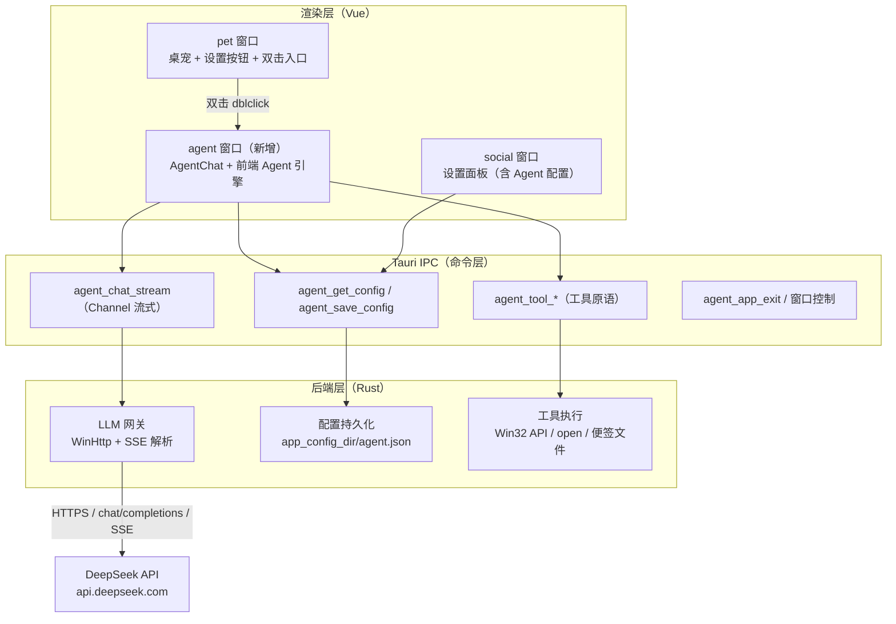
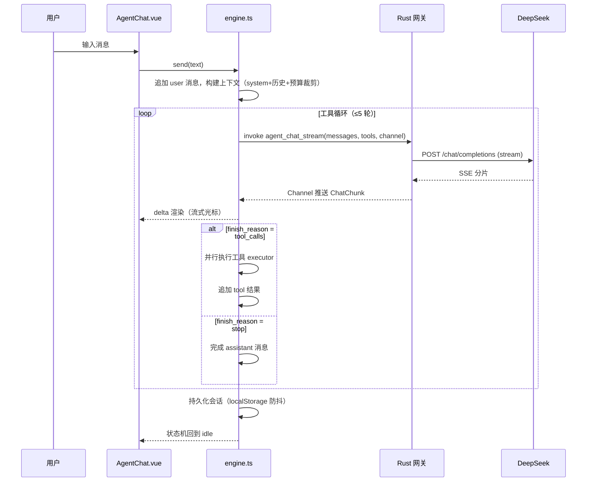

# 桌宠升级桌面 Agent —— 分析与实现计划

## 1. 任务
将现有 Tauri 2 + Vue 3 桌宠（`new_ai`）升级为可交互的桌面 Agent：

- 双击桌宠打开 Agent 聊天窗口，窗口具备**最小化 / 隐藏 / 退出**三个基本控制按钮；
- 基于基础 Agent 框架进行设计：**上下文维护与管理、基础工具调用、Agent 工作流**；
- LLM 采用 **DeepSeek 云端 API**（OpenAI 兼容接口）。

本文件为分析、设计、开发一体方案，后续按 Task 逐步执行。

## 2. 目标（可验收清单）
- [x] 双击桌宠可打开 Agent 聊天窗口并聚焦；隐藏/最小化后再次双击可重新打开
- [x] Agent 窗口标题栏具备 最小化 / 隐藏 / 退出 按钮，行为正确
- [x] 聊天 UI：消息气泡、流式输出、工具调用状态、错误提示、会话持久化与恢复
- [x] 后端 LLM 网关：DeepSeek `chat/completions` + SSE 流式，API Key 不暴露给渲染进程
- [x] 上下文管理：滑动窗口裁剪 + 超预算摘要压缩 + 会话恢复
- [x] 工具调用：≥5 个内置工具，工具执行循环上限 5 轮，安全白名单
- [x] 设置面板新增 Agent 配置区（Key / BaseUrl / Model / 系统提示词 / 工具开关 / 上下文预算）
- [x] 全部通过 `vue-tsc --noEmit` 与 `cargo build`，桌宠与设置功能无回归

> 状态记录（2026-08-14）：以上为**代码实现 + 静态验证**完成状态（`cargo build`、`cargo test` 11/11、`vue-tsc --noEmit` 均通过）。Task6 的 E2E 实机验证、真实 DeepSeek 联调与 release 打包仍未执行，待后续完成。

## 3. 现状分析
### 3.1 技术栈与结构
- **Tauri 2（Rust）+ Vue 3 `<script setup>` + Pinia + Vite**；前端仅 `@tauri-apps/api`、`@vueuse/core`、pinia、vue 依赖。
- 现有双窗口（`tauri.conf.json`）：
  - `pet`：无边框、透明、置顶、`skipTaskbar`，实际约 74x48，渲染皮肤 + 设置按钮；
  - `social`：设置面板 375x477，装饰窗口，`visible:false`，关闭时隐藏而非销毁（`App.vue` 的 `onCloseRequested` 拦截）。
- 已有机制：
  - 托盘菜单：显示宠物 / 隐藏宠物 / 设置 / 退出（`src-tauri/src/tray.rs`）；
  - i18n zh/en（`src/i18n` + `useI18n`，localStorage 同步，跨窗口通过 `storage` 事件）；
  - 主题（`styles/theme.css` CSS 变量 + `stores/settings.ts`）；
  - 宠物交互 `usePetInteraction`：按住 150ms 进入拖拽，短按视为单击（预留 `onClick` 回调，当前未传）；
  - **窗口显示已验证顺序**：`show() → (isMinimized ? unminimize()) → setFocus()`，避免偶发最小化异常。
- 权限（`capabilities/default.json`）：`core:window:default` + `allow-show/hide/set-focus/unminimize/start-dragging/set-size`，另有 `autostart:default`。

### 3.2 关键约束点
- **CSP**：`default-src 'self'`，渲染进程不能直接 `fetch` 外部 API —— 这决定了 LLM 调用必须走 **Rust 后端网关**（也顺带保护 API Key）。
- Rust 依赖极少（tauri / serde / serde_json / autostart / windows），需新增 HTTP 客户端与系统信息/打开链接能力。
- 各窗口同源加载 `index.html`，共享 localStorage（主题/语言已借此跨窗口同步），可作为会话持久化基础。
- 前端目前无测试框架；Rust 具备 `cargo test` 能力。
- 源码为 UTF-8 无 BOM / LF；注释为中文；提交遵循 Conventional Commits。

## 4. 总体架构


**关键设计决策**
1. **LLM 调用放 Rust 后端**：绕开 CSP + API Key 不出渲染进程；前端通过 `tauri::ipc::Channel` 接收流式分片。
2. **Agent 编排放前端 TS**：上下文构建、工具循环、流式渲染与 Vue 状态同源，迭代快、易测试；Rust 只提供“网关 + 工具原语 + 配置持久化”。
3. **工具 Schema 由前端注册表下发**：后端 `agent_chat_stream` 保持通用（只转发 `messages` + `tools`），新增工具无需改 Rust 协议。
4. **会话持久化 MVP 用 localStorage**（同源共享、零依赖），存储模块抽象，后续可无缝迁移后端文件存储。

## 5. 技术栈
**现有**：Tauri 2、Vue 3.5、Pinia、TypeScript 5.7、Vite 6、vue-tsc、@tauri-apps/api。

**新增（Rust）**
- `windows`（`Win32_Networking_WinHttp`）—— HTTPS 客户端（WinHttp API，零额外 crate）；
- `windows`（`Win32_System_SystemInformation` + `Win32_System_Registry`）—— 系统信息工具；
- `open`（v5）—— 打开外部链接（替代手写 `cmd start`）。

> **实现变更说明（2026-08-14）**：初版计划采用 `reqwest` + `futures-util` + `sysinfo` + `tauri-plugin-opener`，实际为减少依赖体积与编译复杂度，改为 **`windows` crate 的 WinHttp API 实现 HTTPS + 手写 SSE 解析**、**`windows` SystemInformation 读取系统信息**、**`open` crate 打开链接**。`llm.rs` 已含 SSE 逐事件解析（`[DONE]`、增量、tool_calls 聚合、错误行）的单元测试。

**新增（前端）**：MVP 无新依赖（手写极简 Markdown/代码块渲染）；后续可选 `marked` + `dompurify`。

**LLM**：DeepSeek OpenAI 兼容 API
- `base_url`：`https://api.deepseek.com`（默认，可配）；
- 端点：`POST {base}/chat/completions`，鉴权 `Authorization: Bearer <key>`；
- 模型：`deepseek-chat`（默认，非思考）/ `deepseek-reasoner`（思考，可选）；
- 128K 上下文；`stream:true` 返回 SSE；`tools`/`tool_calls` 走 OpenAI function calling 格式（支持并行工具调用）。

## 6. 全局约束
- 桌宠窗口行为（透明/置顶/无边框/拖拽/设置按钮）保持不变，不回归。
- **API Key 只在后端配置文件中**；渲染进程不持久化明文（输入框瞬时值除外）；日志、报错信息不得打印 Key。
- **不放开 CSP** 以直连外部 API；LLM 一律走后端网关。
- 工具执行白名单化；MVP 不提供任意 Shell 执行；`open_url` 仅允许 `http/https`，域名白名单可配置。
- 窗口显示统一使用已验证顺序：`show() → if (isMinimized()) unminimize() → setFocus()`。
- 工具循环上限 5 轮；上下文预算默认 24K token（可配），硬上限 60K。
- 代码风格与现有保持一致：Composition API、i18n key 补全中英文、theme.css 变量、UTF-8 无 BOM / LF。
- 每个 Task 完成后必须通过 `vue-tsc --noEmit`（前端改动）与 `cargo build`（Rust 改动）再进入下一步。

## 7. Agent 框架设计分析

### 7.1 LLM 接入（DeepSeek 网关）
- **请求构造**：`{ model, messages, tools?, stream: true, temperature: 0.7 }`；
- **SSE 解析**：逐行读取 `data: {json}`；取 `choices[0].delta.content` 增量、`delta.tool_calls` 增量、`choices[0].finish_reason`；遇 `data: [DONE]` 结束；
- **流式通道**：`tauri::ipc::Channel<ChatChunk>`，前端 `new Channel<T>()` 传入 `invoke`，后端分片推送：
  ```ts
  type ChatChunk =
    | { kind: 'delta'; text: string }
    | { kind: 'tool_calls'; calls: ToolCall[] }
    | { kind: 'finish'; reason: string }
    | { kind: 'error'; code: AgentErrorCode; message: string }
  ```
- **错误映射**：`401` 密钥无效 / `402` 余额不足 / `429` 限流（提示稍后重试）/ `5xx` 服务端异常 / 超时与网络不可用；统一 `AgentErrorCode` 供 UI 转 i18n 文案；
- **中断**：Channel 可关闭，前端“停止生成”即断开并丢弃未完成回复。

### 7.2 上下文维护与管理
- **消息模型**
  ```ts
  type ChatMessage =
    | { id: string; role: 'system' | 'user' | 'assistant'; content: string; createdAt: number }
    | { id: string; role: 'assistant'; content: string; toolCalls?: ToolCall[]; createdAt: number }
    | { id: string; role: 'tool'; toolCallId: string; name: string; content: string; createdAt: number }
  ```
- **会话模型**：`ChatSession { id, title, createdAt, updatedAt, messages[] }`；标题取首条用户消息截断。
- **上下文组装**：`system prompt → 历史（预算内） → 最新 user 消息`；`tools` 由注册表生成。
- **Token 估算**：启发式 —— CJK 每字符约 1 token、ASCII 每 4 字符约 1 token；用于预算裁剪。
- **超预算策略（两级）**
  1. *滑动窗口*：优先丢弃最旧的成对 `user/assistant`，保留 system 与最近 N 轮（按预算反推 N）；
  2. *摘要压缩*：仍超预算时，调用 LLM 将最旧块压缩为一条 `role:system` 的摘要消息并替换，UI 标记“早期对话已摘要”；MVP 每会话最多触发 1 次。
- **持久化**：`localStorage['new-ai-agent-sessions']`，写入防抖 500ms；打开 Agent 窗口时恢复最后会话；新建/清空入口。
- **系统提示词**：默认桌宠助手人设（名称 New AI、能力说明、工具使用规范、安全约束），可在设置中编辑。

### 7.3 工具调用
- **注册表（前端 `src/agent/tools.ts`）**：每项包含
  ```ts
  interface AgentTool {
    name: string
    description: string
    parameters: JSONSchema            // 传给 LLM 的 function schema
    executor: (args: unknown) => Promise<string>  // 调 Rust 命令，返回结构化 JSON 字符串
  }
  ```
- **MVP 工具清单（Rust 实现）**
  | 工具名 | 作用 | 后端命令 |
  | --- | --- | --- |
  | `pet_show` / `pet_hide` | 显示 / 隐藏桌宠 | `agent_tool_pet_show` / `agent_tool_pet_hide` |
  | `open_url` | 打开链接（http/https + 白名单） | `agent_tool_open_url` |
  | `system_info` | OS / 主机 / CPU / 内存 / 运行时长 | `agent_tool_system_info` |
  | `get_time` | 当前日期时间与时区 | `agent_tool_get_time` |
  | `note_create` / `note_list` | 本地便签写入 / 列出 | `agent_tool_note_create` / `agent_tool_note_list` |
- **执行循环**：LLM 返回 `tool_calls`（可并行）→ 前端并行执行 `executor` → 以 `role:'tool'` 结果回填 → 再次调用 LLM → 循环，**上限 5 轮**，超限中止并提示“工具调用次数过多”。
- **安全**：白名单注册；无任意 Shell；`open_url` 校验协议与可选域名白名单；后续迭代为危险工具增加“用户确认”流。

### 7.4 Agent 工作流

- **UI 状态机**：`idle → streaming → tool_executing → idle / error / stopped`。

### 7.5 交互与 UI 设计（Agent 窗口）
- **双击入口**：`pet` 窗口 `.pet-app` 增加 `@dblclick.stop="openAgent"`；`openAgent()` 复用已验证的窗口显示顺序（`getByLabel('agent')` → show → 条件 unminimize → setFocus）。设置按钮补充 `@dblclick.stop` 防止事件冒泡误触发。
- **窗口配置**（`tauri.conf.json` 新增）
  ```json
  {
    "label": "agent",
    "title": "New AI Agent",
    "width": 420, "height": 640,
    "minWidth": 360, "minHeight": 480,
    "decorations": false,
    "transparent": false,
    "visible": false,
    "resizable": true,
    "maximizable": true
  }
  ```
- **标题栏**：左侧 `data-tauri-drag-region` 拖拽区 + 标题 + 状态（发送中/工具执行中）；右侧三个按钮：
  - **最小化** → `getCurrentWindow().minimize()`；
  - **隐藏** → `getCurrentWindow().hide()`（保留进程，可从托盘/双击重新打开）；
  - **退出** → `agent_app_exit`（与托盘“退出”一致，`app.exit(0)`）。
- **消息区**：用户气泡（右/主题强调色）、助手气泡（左/面板色）、流式光标、工具调用 chip（工具名 + 结果折叠）、错误提示条（按 `AgentErrorCode` 转 i18n 文案）、空态引导。
- **输入区**：自动增高 textarea；Enter 发送 / Shift+Enter 换行；发送中变为“停止”按钮（abort 通道）。
- **会话栏**：标题 + 新建对话 + 清空；历史会话列表为后续迭代。
- **主题与语言**：复用 `theme.css` 变量与 `useI18n`，深色/浅色/跟随系统与中英文全部走通。

## 8. 任务分解

### Task1：Agent 窗口与双击入口
- **文件**：`new_ai/packages/app/src-tauri/tauri.conf.json`（改）、`new_ai/packages/app/src-tauri/capabilities/default.json`（改）、`new_ai/packages/app/src/App.vue`（改）、`new_ai/packages/app/src/components/AgentChat.vue`（新建，骨架）。
- **接口**：消费 `WebviewWindow.getByLabel('agent')`、`getCurrentWindow()`；产出 `openAgent()`、`@dblclick` 入口、窗口三按钮。
- **步骤1：新增 agent 窗口配置**——`tauri.conf.json` 按 7.5 配置新增窗口；验收：启动后无报错。
- **步骤2：权限**——`capabilities/default.json` 的 `windows` 加入 `"agent"`，新增 `core:window:allow-minimize`；验收：`cargo build` 通过。
- **步骤3：App.vue 分支**——增加 `isAgentWindow = label === 'agent'`，渲染 `AgentChat`；新增 `openAgent()`（复用已验证显示顺序）；`.pet-app` 增加 `@dblclick.stop="openAgent"`，设置按钮补 `@dblclick.stop`；验收：`vue-tsc --noEmit` 通过。
- **步骤4：AgentChat 骨架**——标题栏（拖拽区 + 标题 + 最小化/隐藏/退出三按钮，按钮先调用窗口 API 打日志）；验收：双击桌宠打开窗口并聚焦，三按钮行为正确，桌宠拖拽/单击/设置按钮无回归。
- **期望**：成功——双击打开、按钮生效；失败——双击无响应或窗口偶发最小化（检查顺序与权限）。
- **测试**：手动场景（双击、拖拽 150ms、单击设置按钮、最小化后双击）；命令：`vue-tsc --noEmit`、`cargo build`。
- **提交**：`git commit -m "feat(agent): add agent window and pet double-click entry"`

### Task2：Rust LLM 网关与配置
- **文件**：`src-tauri/Cargo.toml`（改）、`src-tauri/src/llm.rs`（新建）、`src-tauri/src/agent_config.rs`（新建）、`src-tauri/src/lib.rs`（改）。
- **接口**：产出命令 `agent_get_config() -> AgentConfigView`、`agent_save_config(AgentConfigInput)`、`agent_chat_stream(messages, tools, channel)`。
- **步骤1：依赖**——Cargo.toml 增加 `windows`（WinHttp / SystemInformation / Registry）与 `open`（实际实现见第 5 节变更说明）；验收：`cargo build` 通过。
- **步骤2：配置模块**——`agent_config.rs`：`app_config_dir()/agent.json` 读写；字段 `apiKey/baseUrl/model/systemPrompt/toolEnabled/contextBudget`；读取时返回 `{ apiKeySet, apiKeyLast4, ... }`，保存时空 Key 表示保留旧值；验收：`cargo test` 覆盖序列化往返。
- **步骤3：网关**——`llm.rs`：WinHttp 客户端（连接超时 10s、接收超时 180s）；构造 OpenAI 兼容请求；SSE 逐事件解析；Channel 推送 `ChatChunk`；验收：`cargo test` 覆盖 SSE 解析（含 `[DONE]`、增量、tool_calls、错误行）。
- **步骤4：错误映射**——401/402/429/5xx/超时/网络 → `AgentErrorCode`；验收：单测覆盖。
- **期望**：成功——配置读写、SSE 解析、错误映射均有测试且 `cargo build/test` 通过；失败——编译错误或解析丢行（补测试）。
- **测试命令**：`cargo test`、`cargo build`。
- **提交**：`git commit -m "feat(agent): add DeepSeek LLM gateway and agent config"`

### Task3：前端 Agent 引擎（上下文 / 工具 / 工作流）
- **文件**：`src/agent/types.ts`、`src/agent/token.ts`、`src/agent/context.ts`、`src/agent/tools.ts`、`src/agent/engine.ts`、`src/stores/agent.ts`（均新建）。
- **接口**：`engine.send(text, opts)` 返回 AbortController 并派发事件；`useAgentStore()` 暴露 `messages/streaming/toolStatus/error/stop/newChat/clear`；消费 `agent_chat_stream` 与 `agent_tool_*`。
- **步骤1：类型与 token 估算**——7.2 的消息/会话类型 + 估算函数；验收：估算边界（空串、纯 ASCII、纯中文）单测可通过。
- **步骤2：上下文构建**——system + 滑动窗口 + 摘要压缩；验收：超预算时丢弃最旧对、保留 system；摘要触发路径可测。
- **步骤3：工具注册表**——7.3 五个工具 schema + executor；验收：schema 符合 OpenAI tools 格式。
- **步骤4：工作流引擎**——流式接收 + tool loop（≤5）+ abort；验收：与 Task2 网关联调，真实/模拟 Key 走通“问答→工具→最终回答”。
- **步骤5：会话持久化**——localStorage 防抖写入、启动恢复最后会话；验收：刷新/重启后恢复。
- **期望**：成功——闭环可用且状态机正确；失败——流式中断卡 UI（检查 abort 与 finish 分支）。
- **测试**：前端暂用手动 E2E + `vue-tsc --noEmit`（如需可后续引入 vitest 固化 context/token 单测）。
- **提交**：`git commit -m "feat(agent): add agent engine with context, tools and workflow"`

### Task4：设置集成（Agent 配置 UI）
- **文件**：`src/components/SettingsPanel.vue`（改）、`src/stores/settings.ts`（改）、`src/i18n/zh.ts`、`src/i18n/en.ts`（改）。
- **接口**：消费 `agent_get_config` / `agent_save_config`。
- **步骤1：Agent 设置区**——API Key（password 输入 + 已配置掩码提示）、BaseUrl、Model 下拉（`deepseek-chat` / `deepseek-reasoner`）、系统提示词 textarea、工具开关、上下文预算数字输入；验收：UI 与现有分段按钮风格一致。
- **步骤2：存取接线**——进入面板加载配置，保存调用 `agent_save_config`；Key 未改动时传空保留旧值；日志与 console 不打印 Key；验收：保存后重开仍生效、显示掩码状态。
- **期望**：成功——配置持久化且不回显明文；失败——保存无效（检查文件路径与权限）。
- **测试**：手动（改 Key → 重启 → 面板显示已配置）；命令：`vue-tsc --noEmit`。
- **提交**：`git commit -m "feat(agent): add agent config UI in settings"`

### Task5：Agent 聊天 UI 打磨
- **文件**：`src/components/AgentChat.vue`（改）、`src/styles/theme.css`（改，补充聊天组件变量）、i18n 字典（改）。
- **步骤1：消息列表**——气泡、流式光标、极简 Markdown（标题/加粗/行内代码/代码块，MVP 手写避免引入未消毒 HTML）；验收：深浅色与中英文下可读。
- **步骤2：输入区**——自动增高、Enter/Shift+Enter、发送中变“停止”；验收：快捷键与停止行为正确。
- **步骤3：状态反馈**——工具 chip（工具名 + 结果折叠）、错误提示条（按 `AgentErrorCode` 文案）、空态引导、加载态；验收：429/超时等提示明确。
- **步骤4：会话栏**——新建对话 / 清空确认；验收：切换后历史与输入状态正确。
- **期望**：成功——全链路 UX 可用无控制台报错；失败——渲染卡顿（对长消息做分片渲染）。
- **测试**：手动 E2E（长文本、代码块、工具调用、错误、停止）；命令：`vue-tsc --noEmit`。
- **提交**：`git commit -m "feat(agent): polish agent chat UI"`

### Task6：端到端验证与构建
- **文件**：`README.md`（改，补充 Agent 使用与配置说明）。
- **步骤1：静态与单元验证**——`vue-tsc --noEmit`、`cargo build`、`cargo test`；验收：全部通过。
- **步骤2：E2E 清单**——双击打开/三按钮/流式问答/工具调用/会话恢复/设置持久化/桌宠与设置无回归（逐项核对 2. 目标清单）。
- **步骤3：可选打包**——`pnpm build` 后 `tauri build` 验证 release 构建。
- **期望**：成功——清单全绿；失败——按 debug skill 证据驱动定位修复。
- **提交**：`git commit -m "docs(agent): update README"`

## 9. 风险与对策
| 风险 | 影响 | 对策 |
| --- | --- | --- |
| API Key 明文存配置文件 | 泄露风险 | MVP 文档说明；后续接入系统凭据（keyring / Windows Credential Manager） |
| 429 限流 / 余额不足 / 断网 | 不可用 | 统一错误映射 + i18n 提示 + 可重试 |
| 128K 上下文但费用随 token 增长 | 成本 | 默认预算 24K、硬上限 60K，设置可调 |
| 工具误用/任意 URL | 安全 | 白名单注册、协议校验、域名白名单可配；任意 Shell 不纳入 MVP |
| 窗口偶发最小化异常 | 体验 | 沿用已验证顺序 + `isMinimized()` 保护 |
| SSE 断流/长回复 | 体验 | 超时提示 + 停止按钮 + 已渲染内容保留 |

## 10. 自检
- [ ] 目标清单（第 2 节）逐项核对通过
- [x] `vue-tsc --noEmit`、`cargo build`、`cargo test` 全部通过（2026-08-14 复核：11/11）
- [ ] API Key 未出现在日志、报错与前端持久化存储中
- [ ] 桌宠拖拽/单击/设置按钮/托盘功能无回归
- [ ] i18n 中英文与深浅主题下 UI 完整
- [ ] 无遗留调试代码与调试日志
- [ ] 计划与实现冲突处已更新本文件并注明原因

## 11. 执行方式
- 顺序执行 Task1 → Task6；每个 Task 内按步骤推进，**每完成一步即运行对应验证命令**，通过后再继续。
- 每个 Task 完成后提交一次 git（Conventional Commits，信息见各 Task）。
- 计划与实现不符时，更新本文件并注明原因后再继续。
- 前端暂无测试框架：Rust 逻辑用 `cargo test` 覆盖，前端用 `vue-tsc` + 手动 E2E；后续如引入 vitest，将 context/token 单测固化。